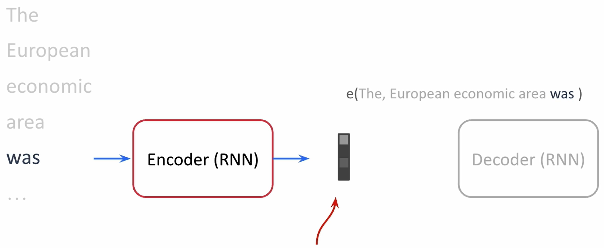
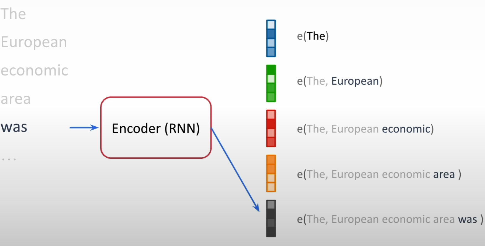
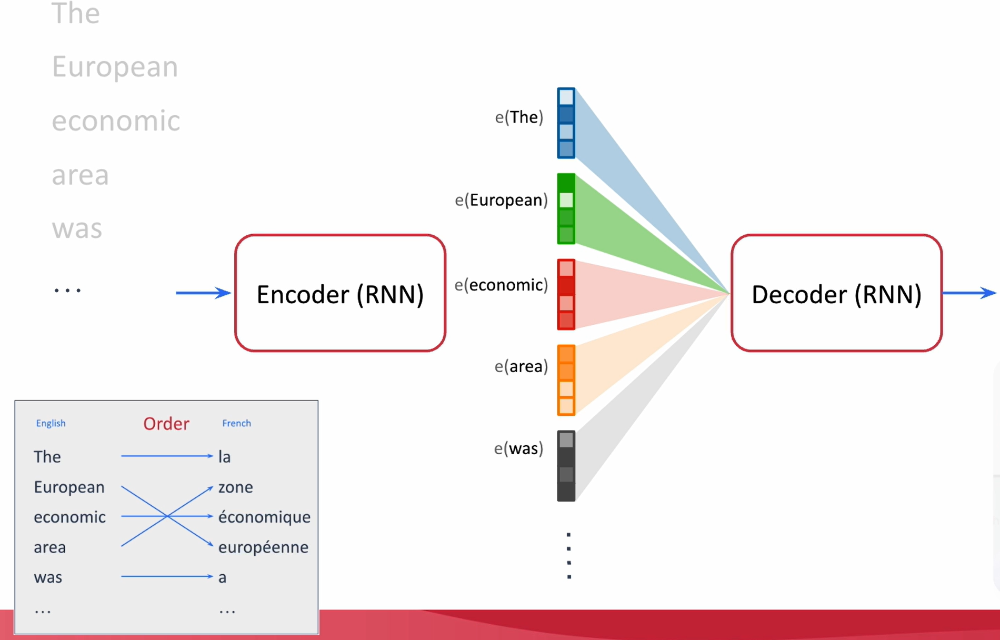
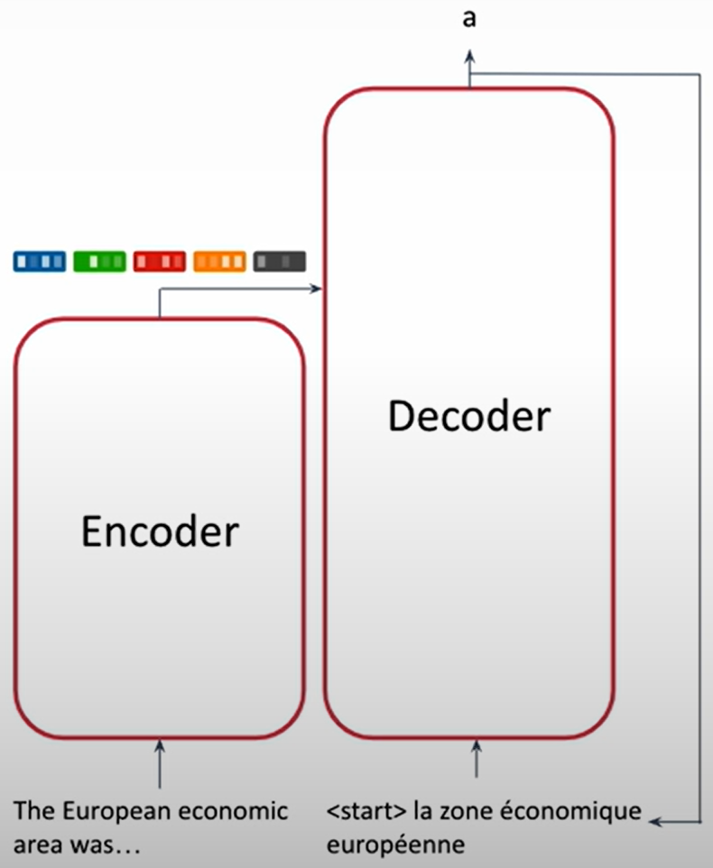

# Introduction

## Invention of Attention Mechanism

- Independently invented for Machine Translation tasks
  - Yoshua Bengio's group
    - [Neural Machine Translation by Jointly Learning to Align and Translate](https://arxiv.org/abs/1409.0473)
  - Christopher Manning's group
    - [Effective Approaches to Attention-based Neural Machine Translation](https://arxiv.org/abs/1508.04025)

- Both research groups discovered that an encoder and decoder mechanism can be effective for translation.

## Machine Translation (~2015)

- Early Approaches
  - Single dense vector representing the whole sentence
  
- Encoder-Decoder Approach
  - Each input word produces vectors which represent the meaning of a word or words in the context of the sentence
  
  - Now referred as contextual embeddings
  - Decoder uses these vectors to generate output of one word at a time.
  
  - Decoder 'weights' or '**attends to**' the inputs based on the previous and current word being generated.

## Attention is All You Need

- Introduced the transformer architecture and general form of attention
- Designed specifically to be highly scalable using GPUs

- The encoder creates contextual embeddings for the input sentence in a single pass
- The decoder produces the output one word at a time
- Each output is fed to the input of the decoder to serve as a context for the next step

### Basis for future models

- The encoder model would go on to be the basis for the BERT algorithm
  - Basis of nearly all of the embedding models
- The decoder model would go on to the basis for the GPT models

## Course Outline

- Main ideas behind Transformer and Attention
- Matrix Math for calculating Self-Attention
- Self-Attention vs Masked Self-Attention
- Encoder-Decoder Attention
- Multi-Head Attention
