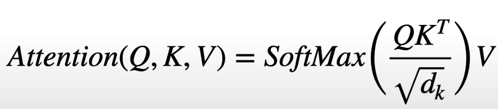
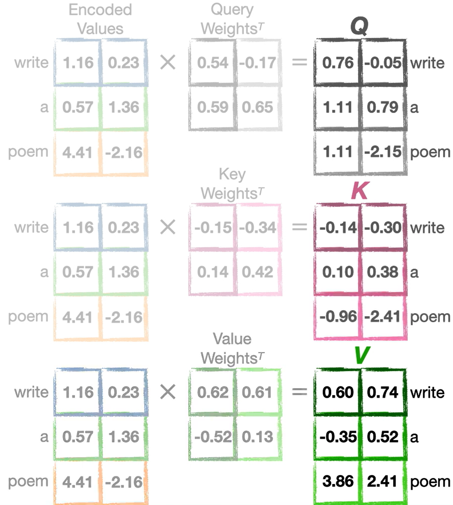
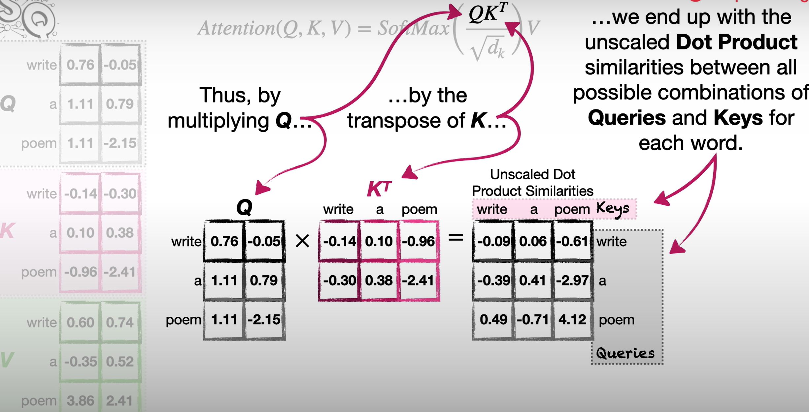

# The Matrix Math for Calculating Self-Attention

- Terms **Query**, **Key** and **Value** come from database technology
- Explained using hotel database example:
  - Objective:
    - Given a guest's surname as query, fetch corresponding room number
    - Query can have spelling error
  - Query: Term used to search the database
  - Key: Last name of the guests
  - Value: Room number
  - Query is compared with all the keys and ranks them
    - Comparison is based on similarity between query and keys

- Self-Attention Equation
  

## Computation of Queries, Keys and Values

- Word embeddings of the words are multiplied with Query, Key and Value weight matrices.
  
  - Though its usual to have vector embedding of dimension 512 or more, here dim=2 is considered for illustration.

## Dot Product Similarities

- Dot Product is unscaled version of Cosine similarity
