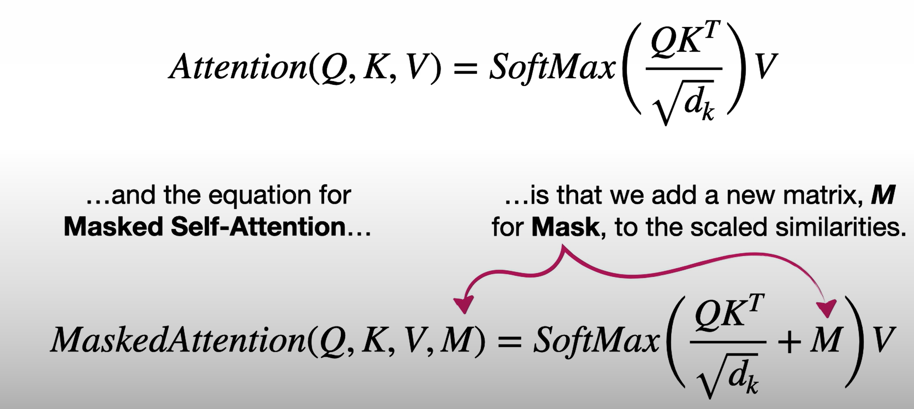
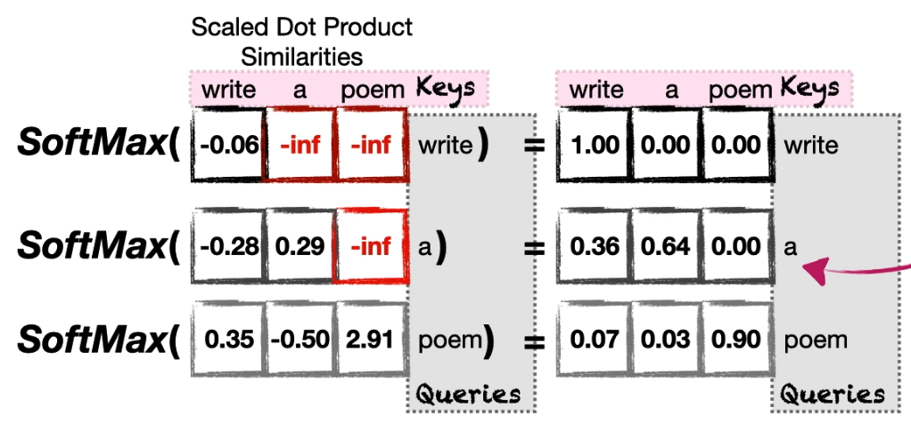
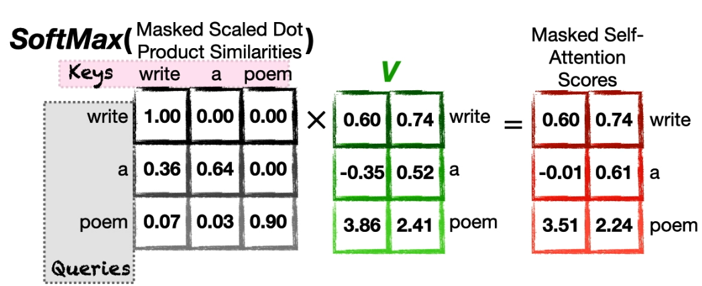

# The Matrix Math for Calculating Masked Self-Attention

- Self-Attention vs Masked Self-Attention Equation
  
- Purpose of mask
  - Prevent tokens from including anything that comes after them when calculating attention
- Mask value $-inf$ applied
  
  - $-inf$ converts masked tokens' softmax value to 0
- Masked self-attention is reflected on the value computation
  - Only previous tokens have influence
  
