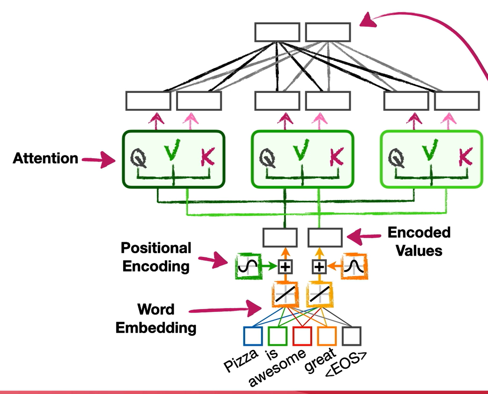
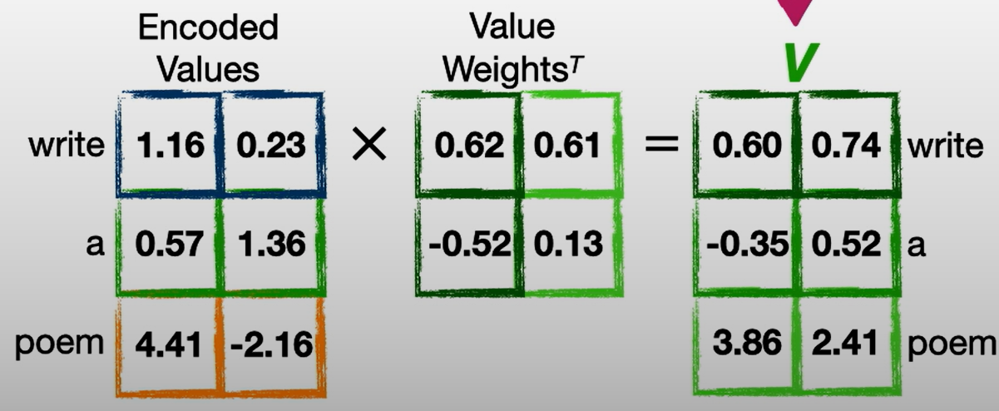
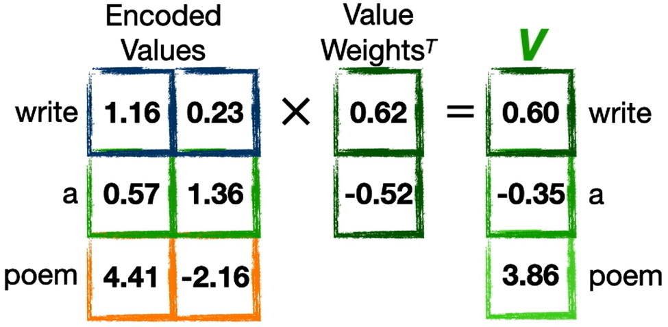

# Multi-Head Attention

- N.B. 2 attention values per head in the above illustration refers to the examples from the notebooks in Lesson [#3](./Lesson_3.md#notebook), [#6](./Lesson_6.md#notebook).
- N heads leads to N * attention values for single head.
- To back down to original number of encoded values, all the attention values are connected to a fully connected layer that has outputs of size of attention values for single head.

- Alternative approach
  - Reduce the number of columns of matrix
  - Instead of matrix with 2 columns
    
    use matrix with 1 column
    
    and correspondingly use 2 heads.
